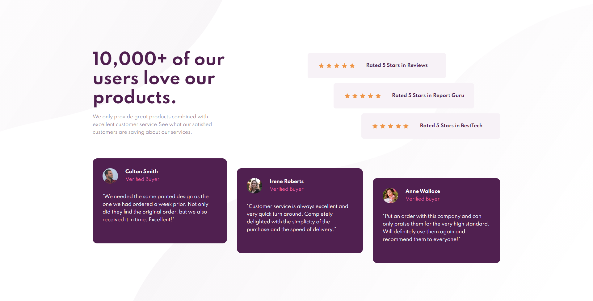

# Frontend Mentor - Social proof section solution

This is a solution to the [Social proof section challenge on Frontend Mentor](https://www.frontendmentor.io/challenges/social-proof-section-6e0qTv_bA). Frontend Mentor challenges help you improve your coding skills by building realistic projects. 

## Table of contents

- [Overview](#overview)
  - [The challenge](#the-challenge)
  - [Screenshot](#screenshot)
  - [Links](#links)
- [My process](#my-process)
  - [Built with](#built-with)
  - [What I learned](#what-i-learned)

## Overview

### The challenge

Users should be able to:

- View the optimal layout for the section depending on their device's screen size

### Screenshot

### Links

- [Solution URL](https://github.com/jma26/Social-Proof-FE-Mentor-6)
- [Live Site URL](https://jma26.github.io/Social-Proof-FE-Mentor-6/)

## My process

### Built with

- HTML5
- CSS custom properties
- Flexbox
- CSS Grid
- Mobile-first workflow

### What I learned

I found the mobile-first workflow to be a lot easier than the desktop version. Mobile design was straight forward while the desktop design was a little bit more intricate in my opinion. Overlapping lenghts of the star rating took a bit of time to figure out, but was somewhat able to do it with `gridbox`.

Likewise with the previous challenges. I had a hard time finding the optimal `background-size + background-position` for the desktop, mobile background patterns. 